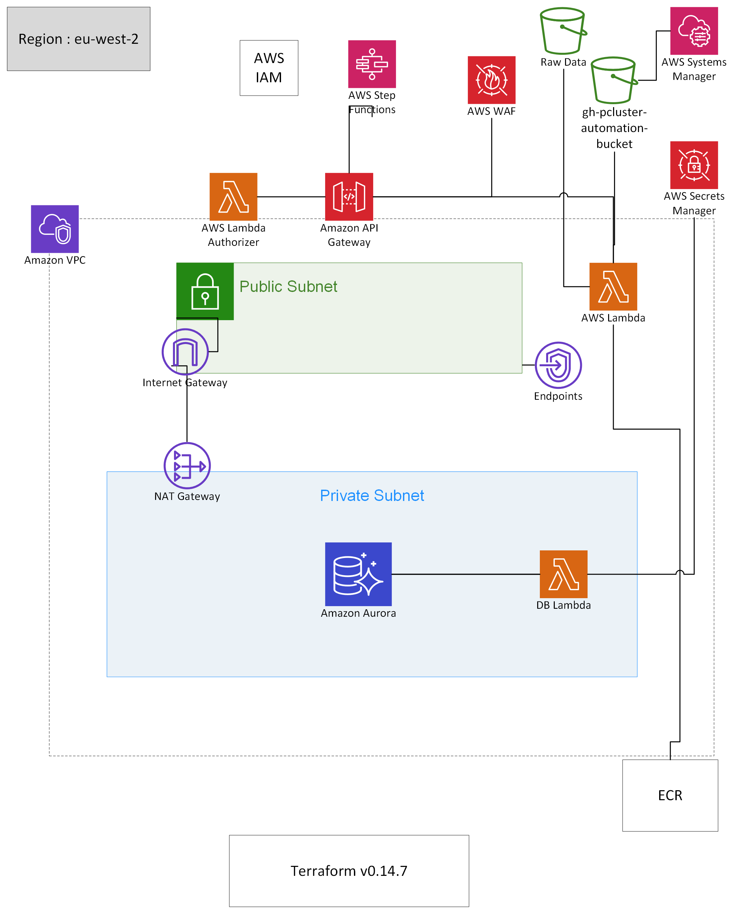

# Infrastructure as code via Terraform 

Deployment folder includes all terraform files required to provision BIP Analysis automation infrastructure.
Terraform v0.14.7

# Steps to Follow

Store DB Password in Secret Manager
      bip_db_pass

Step1 : Install terragrunt on your local machine
         https://terragrunt.gruntwork.io/docs/getting-started/install/
Step2:
  ## Export Variables
  export AWS_ACCESS_KEY_ID=< Replace your Key >
  export AWS_SECRET_ACCESS_KEY=< Replace your Key >
  export AWS_DEFAULT_REGION="eu-west-2"
Step3: 
      cd Infra
      change the S3 Bucket name for storing the terraform statefile in terragrunt.hcl
      terragrunt run-all plan
Step4: 
      If everything looks good then apply the terragrunt
      terragrunt run-all apply

# Infra code resources
  ## VPC folder includes code to provision following resource
        - vpc
        - Public Subnets
        - Private Subnets
        - NAT Gateway
        - Internet Gateway
        - cloudwatch loggroup
        - VPC endpoints
            1. SecretManager endpoint
            2. SSM endpoint
            3. ec2 endpoint
            4. ecr endpoint
        - Store private subnet IDs and VPC IDs in parameter store

  ## RDS folder includes code to provision following resource in private subnet
        - Aurora postgres cluster db (version 11.9)
        - Aurora postgres db instance (version 11.9)
        - DB Cluster and database parameter groups
        - cloudwatch loggroup

  ## Functions folder includes code to provision following resource
        - create-table-lambda to create base table in Aurora Postgres DB required for automation
        - event_lambda which gets invoke when filename "CopyComplete.txt" gets copied to bip-bucket S3 bucket 
        - cloudwatch loggroup

  ## ECR
        create ECR repository
    
  ## S3 
        creates following buckets
        - bip-bucket
        - gh-pcluster-automation-bucket
    
  ## IAM
        create parallelcluster-custom-policy - required for parallel cluster to run

  ## SNS
        create SNS topic "gh-bip-notify" and subscribe to this topic with some specific emailids

  ## WAF
        create waf-web-acl rule with AWS managed rule sets
            AWSManagedRulesCommonRuleSet
            AWSManagedRulesLinuxRuleSet
            AWSManagedRulesSQLiRuleSet

# Steps to Follow for COPY API
	line45:
	create_table1 = '''
            CREATE TABLE gh_bip_data_copy 
                (
                    id serial PRIMARY KEY,
                    task_name VARCHAR ( 50 ), 
                    task_id VARCHAR ( 255 ), 
                    execution_id VARCHAR ( 255 ), 
                    sourcename VARCHAR ( 255 ) NOT NULL, 
                    destinationname VARCHAR ( 255 ) NOT NULL, 
                    status VARCHAR ( 50 ), 
                    created_on TIMESTAMP NOT NULL, 
                    upated_on TIMESTAMP 
                );
        '''
        cur.execute(create_table1)

 2. Upload publicKey to s3://gh-pcluster-automation-bucket

 3. Create SecretManager entry
 	Type: Other type of secrets
 	secretName : gh-key-name
 	secretValues:

 	gh-key	<API_KEY>
	ip_range	<comma saperated CIDR range>
